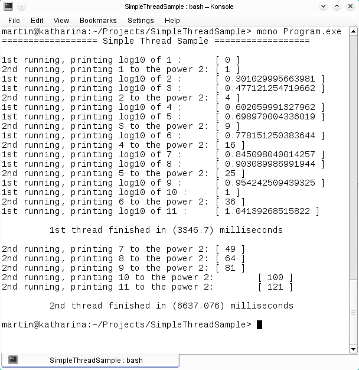
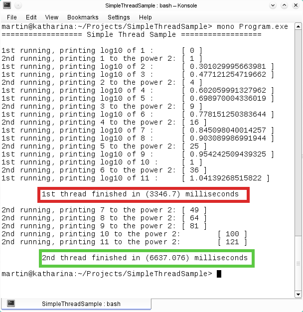

# Threading: Programa que muestra la creación y ejecución de subprocesos.
        

            Todos los sistemas operativos modernos permiten el uso de la concurrencia para hacer varias operaciones de manera simultánea o en paralelo, una manera actual de realizar la concurrencia es con el concepto de <b>threads</b> (hilos).
        

        

            Un thread es un proceso ligero o un subproceso que tiene un simple flujo de control secuencial, el programa principal siempre tiene un simple flujo de control.
        

        

            Un programa en C# empieza en un único Thread creado automáticamente por el CLR y el sistema operativo.
            Los métodos que son comúnmente utilizados por los Threads son:
            <ul>
                <li><b>Start:</b> Inicia la ejecución y el hilo pasa al estado Running.</li>
                <li><b>Suspend:</b> Interrumpe la ejecución, puede reanudarse la ejecución si se invoca al método <b>Resume</b> del hilo que está en estado suspendido.</li>
                <li><b>Sleep:</b> Se invoca con un argumento que recibe la cantidad de milisegundos que el <i>thread</i> que se encuentra en estado <b>Running</b> debe dormir. Al terminarse este tiempo el <i>thread</i> vuelve al estado <b>running</b></li>
                <li><b>Resume:</b> Reanuda la ejecución de un Thread en estado suspendido y lo pasa al estado <b>running</b>.</li>
            </ul>
        

        
Una vez que un <i>thread</i> termina, no puede ser reiniciado.

        
Para mostrar estos conceptos escribí un programa para demostrar las técnicas básicas de creación de subprocesos llamado SimpleThreadSample, este programa crea un par de subprocesos (threads) que correrán simultáneamente dentro del <i>thread</i> principal del programa. 

        
Cada subproceso corre con una prioridad normal, imprimiendo un mensaje en la consola dentro de un ciclo, invocando al método Sleep para permanecer inactivo.

        
El primer subproceso tendrá una inactividad de 300 milisegundos y el segundo subproceso tendrá una inactividad de 600 milisegundos.

            El programa crea cada subproceso con la clase <i>ThreadStart</i> pasando como argumento para el primer subproceso el método <i>PrintLog10</i> que imprime el logaritmo del numero 10 y para el segundo subproceso el método <i>Squared</i> que imprime el cuadrado.
        Una vez creados ambos subprocesos se invoca el método <i>Start()</i> de cada uno de ellos, para pasarlos al estado <b>Running</b>.
        

        

 
        
Al terminar la ejecución de cada uno de los subprocesos, imprime los milisegundos que tardo en ejecutarse.

        

 
        
